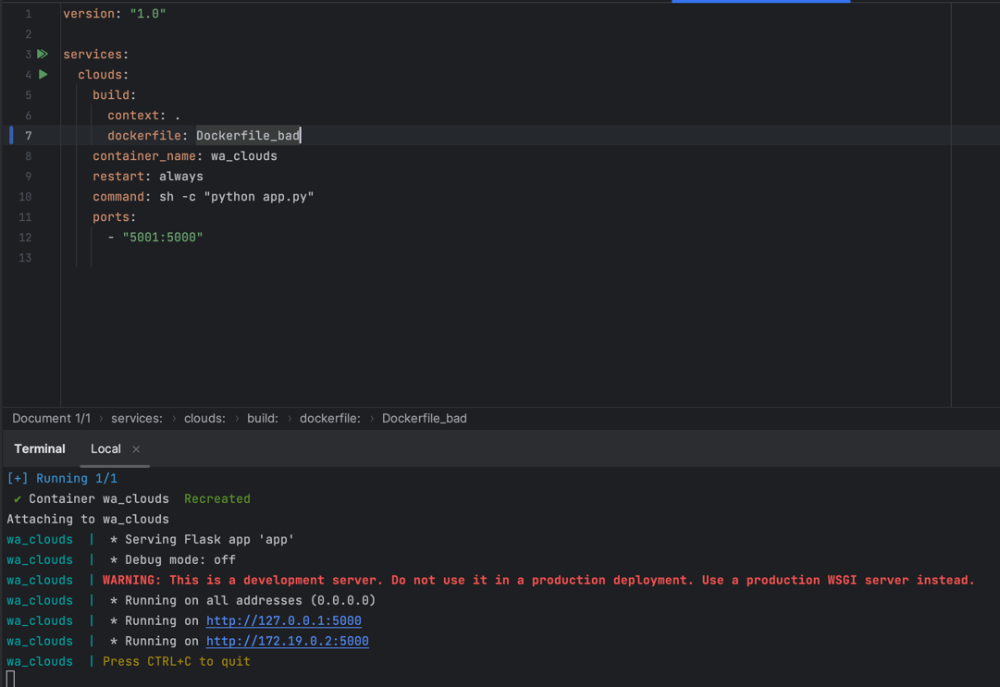
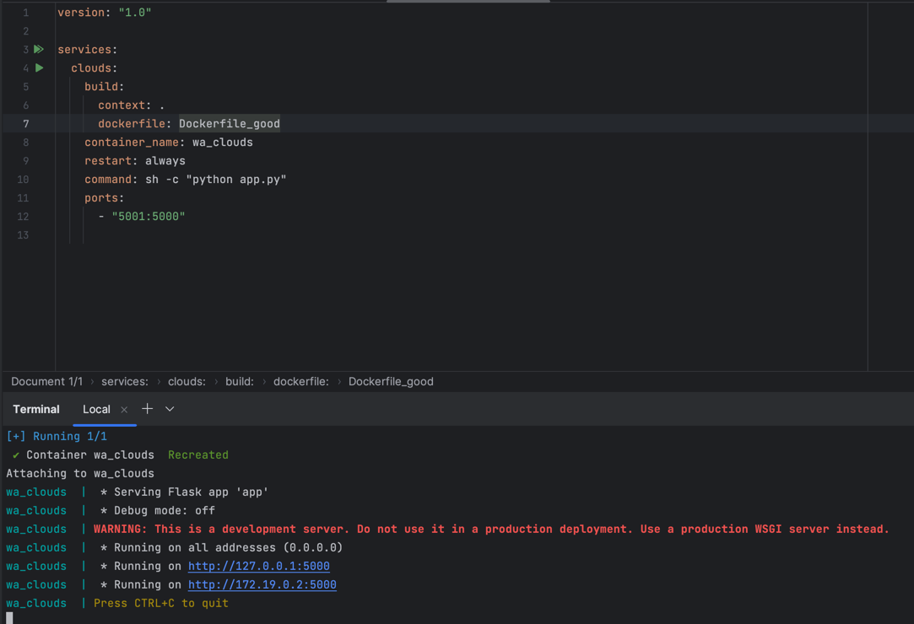
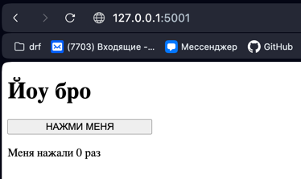

# devops2

Внутри контейнера будет работать web-сервер на Flask

Чтобы запустить контейнер:

```commandline
docker compose up -d --build
```
##### Запуск плохого контейнера


##### Запуск хорошего контейнера


##### Страница после запуска


## Сравнение Dockerfile'ов


### Dockefile_bad

```dockerfile
FROM python:latest
```

### Dockerfile_good
```dockerfile
FROM python:3.9.5-slim-buster
```
Конкретная версия образа позволяет избежать проблем с обновлением версии python в будущем

---

### Dockefile_bad

```dockerfile
ADD . .
WORKDIR code
```

### Dockerfile_good
```dockerfile
WORKDIR /code
```
Более читаемо и понятно

---

### Dockefile_bad
```dockerfile
RUN pip install -r requirements.txt
RUN pip install -r requirements.txt
```

### Dockerfile_good
```dockerfile
RUN pip install --upgrade pip && \
    pip install -r requirements.txt
```
Уменьшает размер образа из-за уменьшения количества слоев

---

### Dockefile_good
```dockerfile
RUN useradd -m -r -u 1000 newuser
USER newuser
```
Позволяет запускать контейнер от пользователя с меньшими правами

---

### Плохие практики при работе с контейнеризацией:
1. Хранить секретные значения внутри контейнера (существуют специализированные решения, которые позволяют не раскрывать токены в логах и при пуше в Docker Hub)
2. Хранить важные данные внутри контейнера (стоит использовать volumes, иначе при перезапуске данные будут потеряны)